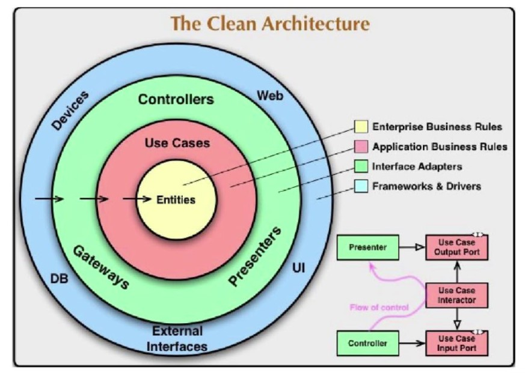
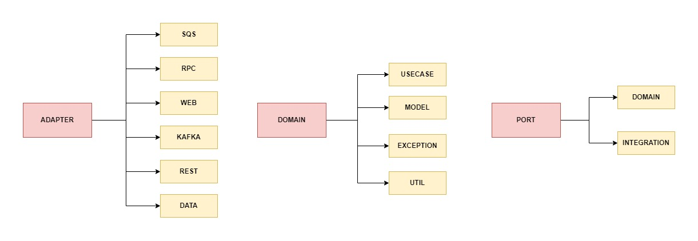
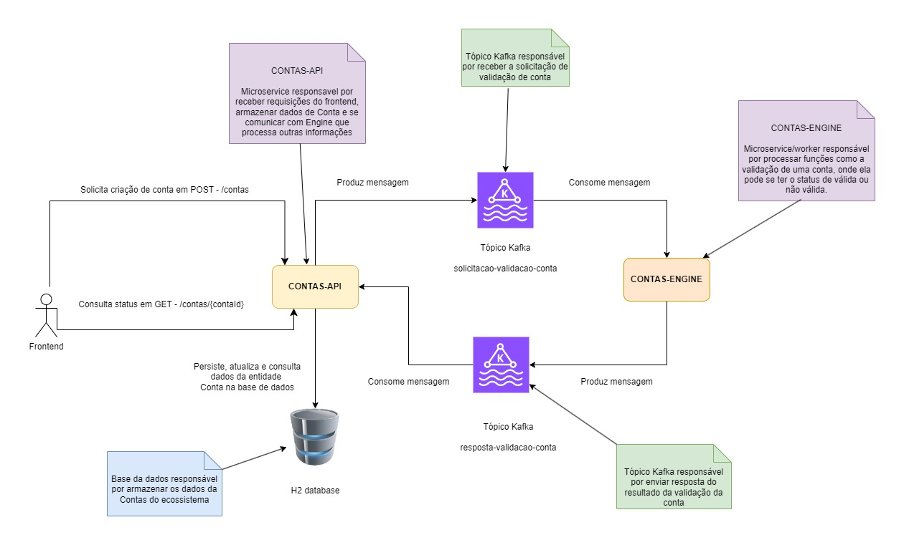

# contas-api

O `contas-api` é o microservice responsável por receber requisições de usuários do frontend, armazenar dados de Contas e por se comunicar via Kafka com o workers resposáveis por outras funções.

Informações mais detalhadas abaixo.

## Arquitetura Hexagonal

Segue uma imagem classica sobre o conceito de Arquitetura Hexagonal:



Foi primeiramente apresentada pelo Alistair Cockburn em 2005 e também citada pelo Robert Martin no livro Clean Architecture.

Basicamente, as camadas mais internas não podem se comunicar com as camadas mais externas e nas mais internas é onde devem ficar centralizadas as regras de negocios.

Tanto as mais internas e externas podem utilizar interfaces que abstraem o comportamento. As camadas internas chamas as externas através de "ports" e os ports são implementados no adaptadores conforme a tecnologia disponível conforme o contexto.

Essa abordagem permite que uma aplicação que tenhas as suas regras principais de negocio no domain, posso migrar o uso de um adaptar ActiveMQ para Kafka sem que seja necessário realizar qualquer alteração nas regras principais.

Na implementação, em geral utilizei a seguinte abordagem:



## Arquitetura do projeto

Nesse projeto, fiz uma simulação simples de uma aplicação onde com uma chamada REST POST com campo "nome" preenchido é gerada uma "Conta".

Nessa request `POST - /contas`, já é retornado um ID de conta em caso de criação da conta com sucesso.

Porém, o processo somente é concluido de forma assincrona, onde ocorre a validação da Conta, em que é definido se a conta foi aprovada (aprovada: TRUE) ou reprovada (aprovada: FALSE). Quem "traz" esse status de aprovada, é um API externa que é chamada pelo contas-engine.

Com o retorno da aprovação da conta, o contas-engine posta no tópico `resposta-validacao-conta` o resultado da mesma para determinada conta. O contas-api le a mensagem e atualiza a base de dados que ele é responsável.

A Conta fica disponível para consulta no contas-api no endpoint `GET - /contas/{contaId}`.

Segue abaixo um diagrama que representa parte da estrutura do projeto:



## Endpoints

### POST - /contas

URL:

`http://localhost:8080/contas`

Body da request:


```json
{
  "nome": "Joao da Silva"
}
```

Response:

```json
{
  "id": "7cd2d05a-a363-4b02-adb7-c9e79135e997",
  "nome": "Joao da Silva"
}
```

### GET - /contas/{contaId}


URL:

`http://localhost:8080/contas/a98fd208-722f-4175-948b-f45134240c6a`

Response:

```json
{
    "id": "a98fd208-722f-4175-948b-f45134240c6a",
    "nome": "Jose Antonio",
    "aprovada": true
}
```

## Como rodar o projeto

Requisitos básicos:

- Java 21
- Maven (ou usa o mvnw que já está no projeto)
- Docker
- Docker-Compose

Atendendo os requisitos básicos, é necessário ter um service Kafka rodando em `localhost:9092`.

Na pasta `dockercompose` tem um arquivo docker-compose.yml com um exemplo de um compose com Kafka Server e Zookeeper que faz tudo funcionar local.

Com o Kafka rodando. É possível dessas formas:

**Forma 1) Plugin do Spring Boot**

```bash
./mvnw spring-boot:run
```

**Forma 2) Com o mvn build e rodando o .jar do projeto**

```bash
./mvnw clean package && java -jar target/*.jar
```

**Forma 3) Pela propria IDE, como o Intellij :)**

Fiz boa parte rodando pelo intellij, salvo alguns testes.

## Docker e Dockerfile

Para rodar locamente o projeto como uma imagem docker, seguir os comandos a seguir. 

Na pasta raiz do projeto:

```` bash
docker build -t contas-api .
docker run --network=host contas-api
````

É preciso que o Kafka está conectado na rede.